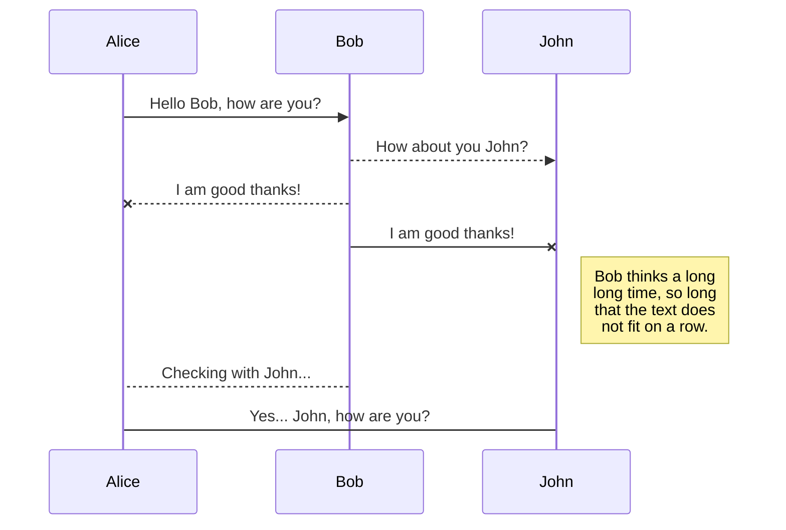
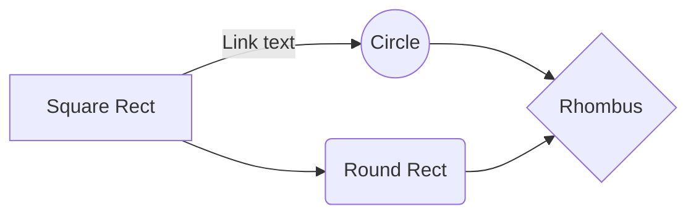

Copyright (c) 2020, [Nabeel Khan](https://www.nabeelkhan.com)
All rights reserved.

# Data Science Journey

_**"If You Can't Measure It, You Can't Improve It."**_

A document with bried introduction into [Data Science](https://github.com/nabeelkhan/Data-Science-Journey/blob/main/What%20is%20Data%20Science%20and%20Machine%20Learning.md) and [Machine Learning](https://github.com/nabeelkhan/Data-Science-Journey/blob/main/What%20is%20Data%20Science%20and%20Machine%20Learning.md) with templates to kick-start your projects. This repositry will contain source code to explain the concept into details.

Copyright (c) 2020, [Nabeel Khan](https://www.nabeelkhan.com)
All rights reserved.

## Introduction

Traditional Method --- vs --- Machine Learning Method


## Approaching Problems as a Data Scientist

I will _sketch_ some portions to keep in mind when structuring your [data science](https://github.com/nabeelkhan/Data-Science-Journey/blob/main/What%20is%20Data%20Science%20and%20Machine%20Learning.md) project before you get into the analysis and modeling phase, then we will get into some technical details regarding preparing data for modeling in the next section. It is very important to ensure you have a well-structured plan for your project beforehand. I cannot emphasize enough on writing down all the details rather just keeping that in your immediate memory.

This document is centered around Jupyter Notebooks because they are a very convenient way to document your planning notes, analysis, and modeling plans, keeping these notes in the same place as your proceeding analysis can help others understand what you're doing when they see your work or provide context for you when you look back at your code after a while.

A large part of [data science](https://github.com/nabeelkhan/Data-Science-Journey/blob/main/What%20is%20Data%20Science%20and%20Machine%20Learning.md) involves the use of [machine learning](https://github.com/nabeelkhan/Data-Science-Journey/blob/main/What%20is%20Data%20Science%20and%20Machine%20Learning.md) to build predictive models. When formulating a plan for predictive modeling, you should start by considering your stakeholder's needs. A perfect model will be useless if it doesn't solve a relevant problem. Planning a strategy around business needs ensures that a successful model will lead to actionable insights.

# Predictive Modeling and Data Analytics
Of the four types of data analytics, predictive modeling is most closely related to the predictive analytics category. The fur types of data analytics are:
- Descriptive Analytics: Descriptive analytics describes the data. For example, a software-as-a-service (SaaS) company sold 2,000 licenses in Q2 and 1,000 licenses in Q1. Descriptive analytics answers the question of how many licenses were sold in Q1 vs. Q2.
- Diagnostic Analytics: Diagnostic analytics is the why behind descriptive analytics. To use the previous example, diagnostic analytics takes data a step further. A data analyst can drill down into quarterly software license sales and determine sales and marketing efforts within each region to reference them against sales growth. They could also see if a sales increase was a result of high-performing salespeople or rising interest within a certain industry.
- Predictive Analytics: Predictive analytics utilizes techniques such as machine learning and data mining to predict what might happen next. It can never predict the future, but it can look at existing data and determine a likely outcome. Data analysts can build predictive models once they have enough data to make predicted outcomes. Predictive analytics differs from data mining because the latter focuses on discovery of the hidden relationships between variables, whereas the former applies a model to determine likely outcomes. A SaaS company could model historical sales data against marketing expenditures across each region to create a prediction model for future revenue based on marketing spend.
- Prescriptive Analytics: Prescriptive analytics takes the final step and offers a recommendation based on a predicted outcome. Once a predictive model is in place, it can recommend actions based on historical data, external data sources, and machine learning algorithms.


## Basic Syntax

These are the elements outlined in John Gruber’s original design document. All Markdown applications support these elements.

### Heading

# H1

## H2

### H3

### Bold

**bold text**

### Italic

_italicized text_

### Blockquote

> blockquote

### Ordered List

1. First item
2. Second item
3. Third item

### Unordered List

- First item
- Second item
- Third item

### Code

`code`

### Horizontal Rule

---

### Link

[title](https://www.example.com)

### Image


## Extended Syntax

These elements extend the basic syntax by adding additional features. Not all Markdown applications support these elements.

### Table

| Syntax    | Description |
| --------- | ----------- |
| Header    | Title       |
| Paragraph | Text        |

### Fenced Code Block

```
{
  "firstName": "John",
  "lastName": "Smith",
  "age": 25
}
```

### Footnote

Here's a sentence with a footnote. [^1]

[^1]: This is the footnote.

### Heading ID

### My Great Heading {#custom-id}

### Definition List

term
: definition

### Strikethrough

~~The world is flat.~~

### Task List

- [x] Write the press release
- [ ] Update the website
- [ ] Contact the media

## UML diagrams

You can render UML diagrams using [Mermaid](https://mermaidjs.github.io/). For example, this will produce a sequence diagram:



And this will produce a flow chart:


